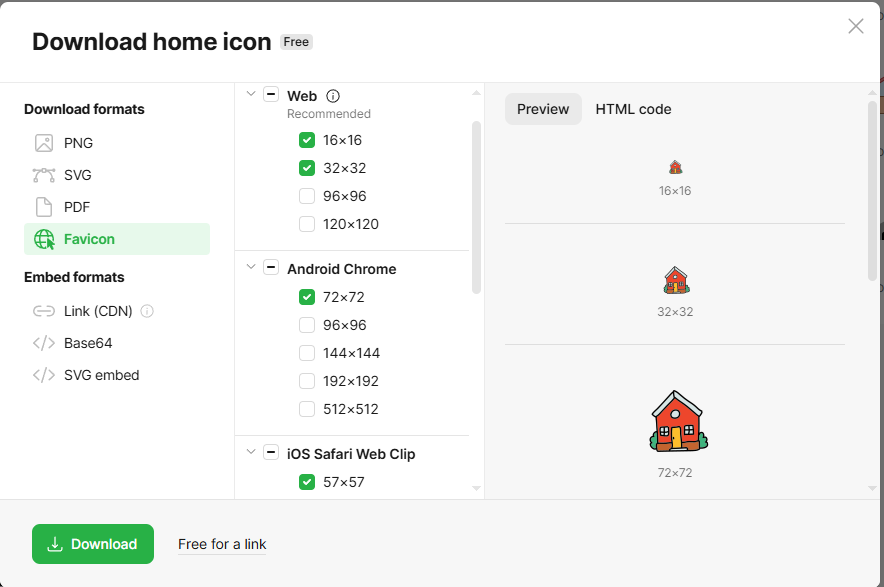
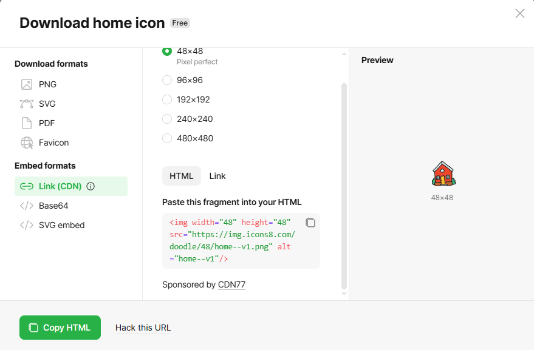
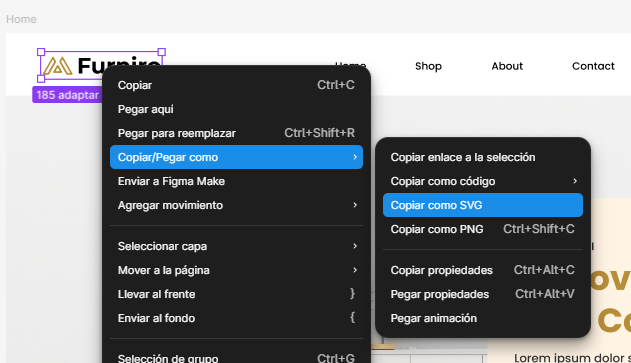

# Landing Page - Interior Design

Landing Page Desarrollada con HTML5 y CSS3 (CSS solo es un ejemplo basico), tomando como referencia un diseño de interfaz creado en figma

El proyecto está orientado principalmente al aprendizaje y la práctica de la **maqeutación web**, trabajando recursos externos mediante CDN y mantenidnedo recursos locales como respaldo (_fallback_) cuando resulta necesario.

## COntenido

- [Sobre el proyecto](#sobre-el-proyecto)
- [Tecnologías y recursos](#tecnologías-y-recursos)
- [Estructura del Proyecto](#estructura-del-proyecto)
- [Assets](#assets)
  - [Imágenes](#imágenes)
  - [Favicon](#favicon)
  - [Tipografías](#tipografías)
- [Theme-Color](#theme-color)
- [Iconos](#iconos)
- [Estructura de la página](#estructura-de-la-página)
- [Diseño de referencia](#diseño-de-referencia)
- [Clonar el proyecto](#clonar-el-proyecto)
- [Fork](#fork)
- [Descargar desde GitHub](#descargar-desde-github)
- [Créditos y referencias](#créditos-y-referencias)
- [Licencia](#licencia)

## Sobre el proyecto

Este proyecto consiste en la creación de una landing page utilizando **HTML5 y "CSS3"**, siguiendo como inspiración un diseño de interfaz para una página de eCommerce relacionada con interiorismo.

Durante el desarrollo se trabajaron diferentes elementos habituales en una página web moderna:

- Barra de navegación.
- Hero section.
- Sección de productos.
- Sección de inspiración.
- Sección para compartir contenido.
- Footer.
- Favicon.
- Theme color.
- Tipografías externas.
- Iconografía.
- Imágenes.
- Recursos locales para fallback.

La intención no es reproducir exactamente el diseño original, sino utilizarlo como **referencia visual para practicar la estructura y maquetación de una interfaz web**.

## Tecnologías y recursos

El proyecto utiliza principalmente:

- **HTML5**
- **CSS3** - _Solo un poquito_
- **Google Fonts**
- **Google Material Symbols**
- **Icons8** - para buscar un icono, nada mas
- **Figma** como referencia de diseño
- **SVG** para determinados elementos gráficos
- Recursos locales almacenados dentro de `assets/`

No se utilizan frameworks ni librerías JavaScript para la estructura principal del proyecto.

## Estructura del proyecto

El proyecto está organizado de forma simple, separando el contenido, los estilos y los recursos utilizados por la página.

```text
.
├── assets/
│   ├── audio/
│   ├── fonts/
│   │   ├── Montserrat/
│   │   └── Orbitron/
│   ├── icons/
│   ├── img/
│   │   ├── favicons/
│   │   └── inicio/
│   └── video/
│
├── css/
│   └── style.css
│
├── pages/
│   ├── about.html
│   ├── contact.html
│   └── products.html
│
├── .editorconfig
├── .gitignore
├── .prettierrc
├── favicon.ico
├── index.html
├── README.md
└── TODO.md
```

### `assets/`

Contiene los recursos locales utilizados por el proyecto.

Se utiliza esta carpeta para mantener organizados los archivos que no forman parte directamente de la estructura HTML.

### `css/`

Contiene los estilos del proyecto.

- `style.css` — Hoja de estilos principal utilizada por las páginas.

### `pages/`

Contiene las páginas HTML secundarias del sitio.

- `about.html` — Página de información.
- `contact.html` — Página de contacto.
- `products.html` — Página de productos.

### Archivos principales

- `index.html` — Página principal y punto de entrada del sitio.
- `favicon.ico` — Favicon principal del sitio.
- `README.md` — Documentación del proyecto.
- `TODO.md` — Lista de tareas, mejoras o funcionalidades pendientes.

### Archivos de configuración

- `.editorconfig` — Define reglas básicas de formato para mantener un estilo consistente entre diferentes editores.
- `.gitignore` — Define los archivos y carpetas que Git debe ignorar y no incluir en el repositorio.
- `.prettierrc` — Contiene la configuración utilizada por **Prettier** para formatear el código.

## Assets

Contiene los recursos utilizados por el proyecto.

| Carpeta         | Uso                                                         |
| --------------- | ----------------------------------------------------------- |
| `audio/`        | Archivos de audio utilizados en el proyecto.                |
| `fonts/`        | Tipografías locales utilizadas como fallback.               |
| `icons/`        | Iconos utilizados por la interfaz.                          |
| `img/`          | Imágenes utilizadas en las páginas.                         |
| `img/favicons/` | Recursos utilizados para generar o utilizar los favicons.   |
| `img/inicio/`   | Imágenes utilizadas específicamente en la página de inicio. |
| `video/`        | Archivos de vídeo utilizados en el proyecto.                |

### Imágenes

Las imágenes utilizadas por la página se encuentran dentro de:

```text
assets/img/
```

Esta carpeta contiene las imágenes utilizadas en las diferentes secciones de la landing page.

**Ejemplo**:

```html

```

### Favicon

Para el favicon se utilizó inicialmente un icono obtenido desde **Icons8**.

[Icons8 — Home Favicon](https://icons8.com/icons/set/home-favicon)

Se seleccionó un icono y se descargó en formato `.ico`.



También se investigó la posibilidad de utilizar el recurso directamente mediante CDN.



Por ejemplo:

```html

```

Finalmente se utilizó un generador de favicon para generar los archivos necesarios a partir de imágenes PNG.

#### Generador utilizado

[Favicon.im — Favicon Generator](https://favicon.im/es/generator)

El objetivo fue evitar realizar manualmente todo el proceso de generación y adaptación de los diferentes tamaños y formatos.

> **Nota:** utilizar un generador no significa que el proceso sea obligatorio. Los favicons también pueden prepararse manualmente utilizando herramientas de edición y conversión de imágenes.

---

### Tipografías

La página utiliza las tipografías:

- **Montserrat**
- **Orbitron**

Las fuentes se obtuvieron desde **Google Fonts**.

[Google Fonts](https://fonts.google.com/?preview.script=Latn)

Se utilizan dos mecanismos:

1. Carga mediante CDN.
2. Archivos locales como fallback.

---

#### Google Fonts mediante CDN

En el documento HTML se incorporan las fuentes mediante:

```html
<link rel="preconnect" href="https://fonts.googleapis.com" />

<link rel="preconnect" href="https://fonts.gstatic.com" crossorigin />

<link
  href="https://fonts.googleapis.com/css2?family=Montserrat:ital,wght@0,100..900;1,100..900&family=Orbitron:wght@400..900&display=swap"
  rel="stylesheet"
/>
```

El uso de CDN permite que el navegador pueda descargar las fuentes desde los servidores de Google.

---

#### Tipografías locales

Las fuentes también se almacenan dentro del proyecto:

```text
assets/fonts/
```

Esto permite disponer de una alternativa local en caso de que la fuente externa no pueda cargarse.

El fallback se define mediante CSS utilizando `@font-face`.

Para comprender cómo funciona esta característica:

- [MDN — @font-face CSS at-rule](https://developer.mozilla.org/en-US/docs/Web/CSS/Reference/At-rules/@font-face)

También se utilizó como referencia:

- [Creating Perfect Font Fallbacks in CSS](https://www.aleksandrhovhannisyan.com/blog/perfect-font-fallbacks/)

---

#### Archivos necesarios

No es necesario conservar absolutamente todos los archivos que pueden venir dentro de una familia tipográfica descargada.

Para este proyecto se conservan solamente los archivos necesarios para los estilos utilizados, por ejemplo:

```text
regular
bold
italic
```

además de la información de licencia correspondiente.

> **Nota:** los archivos exactos pueden variar dependiendo de la familia tipográfica y de los pesos utilizados por el proyecto.

## Theme Color

El proyecto incorpora el atributo `theme-color` mediante una etiqueta `<meta>`.

Esta información permite indicar al navegador un color asociado a la interfaz del sitio.

Ejemplo:

```html
<meta name="theme-color" content="#ffffff" />
```

La referencia utilizada para estudiar esta característica fue la documentación de MDN:

[MDN — meta theme-color](https://developer.mozilla.org/en-US/docs/Web/HTML/Reference/Elements/meta/name/theme-color)

En este caso no es necesario complicar demasiado la implementación: se define el color que corresponde con la identidad visual del proyecto y listo.

> A veces tampoco hay que buscarle la quinta pata al burro.

## Iconos

Para la interfaz se utilizan iconos externos, principalmente mediante **Google Material Symbols**.

La idea es utilizar una biblioteca de iconos ya preparada en lugar de crear manualmente cada icono necesario para la interfaz.

Esto permite mantener una iconografía consistente y reducir la cantidad de recursos gráficos que deben prepararse manualmente.

Los iconos necesarios para el proyecto también pueden mantenerse dentro de:

```text
assets/icons/
```

cuando se requiera disponer de una copia local.

## Estructura de la página

La página está dividida conceptualmente en diferentes secciones:

```text
index.html
│
├── Navigation
│
├── Hero Section
│
├── Our Product
│
├── Inspiration
│
├── Share
│
└── Footer
```

### Navigation

Contiene los elementos necesarios para navegar por las diferentes partes de la página.

### Hero Section

Es la sección principal de presentación y funciona como primer contacto visual con el usuario.

### Our Product

Presenta los productos o elementos principales que forman parte de la propuesta de la página.

### Inspiration

Sección destinada a mostrar contenido visual relacionado con el concepto de diseño interior.

### Share

Sección destinada a incentivar al usuario a compartir el contenido.

### Footer

Contiene la información ubicada al final de la página.

---

## Diseño de referencia

Para la estructura visual se utilizó como inspiración un diseño disponible en la comunidad de Figma:

[eCommerce Website | Web Page Design | UI KIT | Interior Landing Page](https://www.figma.com/community/file/1252561852327562039/ecommerce-website-web-page-design-ui-kit-interior-landing-page)

El diseño pertenece a:

[@uiux_expert — Figma](https://www.figma.com/@uiux_expert?fuid=1578119739605269494)

El diseño se utiliza exclusivamente como **referencia visual y educativa** para practicar la implementación de una interfaz utilizando HTML y CSS.

### Logo en SVG

Como parte del proceso de maquetación se tomó el logo presente en el diseño de referencia y se exportó en formato **SVG** para utilizarlo dentro del proyecto.



El uso de SVG permite conservar la calidad del gráfico independientemente de su tamaño y resulta especialmente apropiado para logotipos e iconografía.

## Clonar el proyecto

Para obtener una copia del proyecto mediante Git, primero es necesario tener instalado Git.

[Git — sitio oficial](https://git-scm.com/)

Desde una terminal:

```bash
git clone https://github.com/carlosandresalzate/pre-entrega.git
```

Después:

```bash
cd REPOSITORIO
```

El proyecto puede abrirse directamente con un editor como **Visual Studio Code**.

---

## Fork

Un **fork** crea una copia del repositorio dentro de tu propia cuenta de GitHub.

Esto resulta especialmente útil cuando querés:

- Experimentar con el proyecto.
- Modificarlo sin afectar el repositorio original.
- Utilizarlo como base para otro proyecto.
- Realizar cambios y posteriormente proponerlos mediante un Pull Request.

### Pasos

1. Abrir el repositorio en GitHub.
2. Seleccionar **Fork**.
3. Elegir la cuenta donde se quiere crear la copia.
4. Clonar el repositorio resultante:

```bash
git clone https://github.com/TU-USUARIO/REPOSITORIO.git
```

5. Entrar en la carpeta:

```bash
cd REPOSITORIO
```

---

## Descargar desde GitHub

También es posible obtener el proyecto sin utilizar Git.

Desde la página del repositorio:

1. Seleccionar **Code**.
2. Seleccionar **Download ZIP**.
3. Descomprimir el archivo.
4. Abrir la carpeta con Visual Studio Code.

Esta opción es la más sencilla si solamente querés revisar el código o utilizar el proyecto como material de aprendizaje.

---

## Créditos y referencias

### Diseño

Diseño utilizado como referencia:

[eCommerce Website | Web Page Design | UI KIT | Interior Landing Page](https://www.figma.com/community/file/1252561852327562039/ecommerce-website-web-page-design-ui-kit-interior-landing-page)

Autor:

[@uiux_expert — Figma](https://www.figma.com/@uiux_expert?fuid=1578119739605269494)

### Iconos

[Icons8](https://icons8.com/)

### Favicon

[Favicon.im](https://favicon.im/es/generator)

### Tipografías

[Google Fonts](https://fonts.google.com/)

### Documentación

[MDN Web Docs](https://developer.mozilla.org/)

---

## Licencia

Copyright (c) 2026 Carlos Andres Alzate

El código fuente de este proyecto se distribuye bajo la licencia MIT.

Esto incluye, entre otros elementos propios del proyecto:

- HTML
- CSS
- JavaScript
- Configuración del proyecto
- Estructura y código fuente desarrollado para la landing page

La licencia MIT permite utilizar, copiar, modificar, distribuir y sublicenciar
el código, incluyendo su uso comercial, siempre que se conserve el aviso de
copyright y la licencia correspondiente.

### Recursos de terceros

Las imágenes, tipografías, iconos, fotografías, videos, audios u otros recursos
de terceros incluidos en el proyecto no están necesariamente cubiertos por la
licencia MIT.

Cada recurso de terceros conserva la licencia otorgada por su respectivo autor
o proveedor y debe utilizarse de acuerdo con sus propios términos de uso.

Cuando corresponda, la fuente y licencia de dichos recursos se indican en la
documentación del proyecto o junto al recurso correspondiente.

### Autor

Carlos Andres Alzate

GitHub: https://github.com/carlosandresalzate

Repositorio: https://github.com/carlosandresalzate/pre-entrega

---

## ✍️ Notas del proyecto

Este proyecto forma parte de un proceso de aprendizaje y experimentación con desarrollo web.

La intención es aprender no solamente a escribir HTML, sino también a organizar un proyecto, administrar recursos, utilizar herramientas externas, preparar fallbacks y documentar las decisiones tomadas durante el desarrollo.

La documentación también funciona como una pequeña bitácora del proceso: qué recursos se utilizaron, de dónde provienen y por qué fueron incorporados al proyecto.
